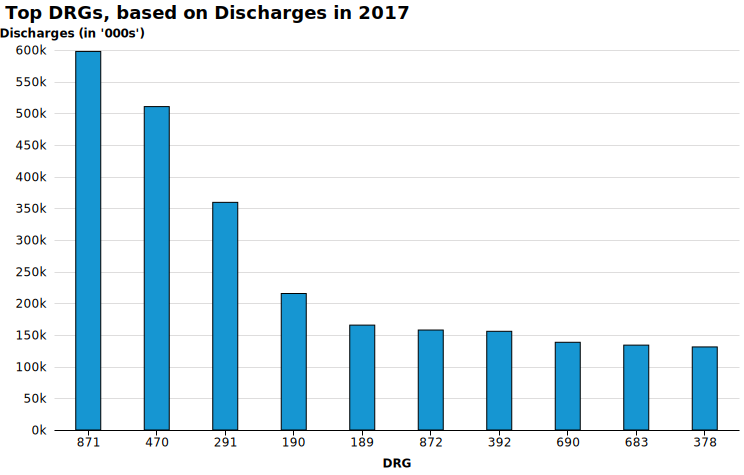
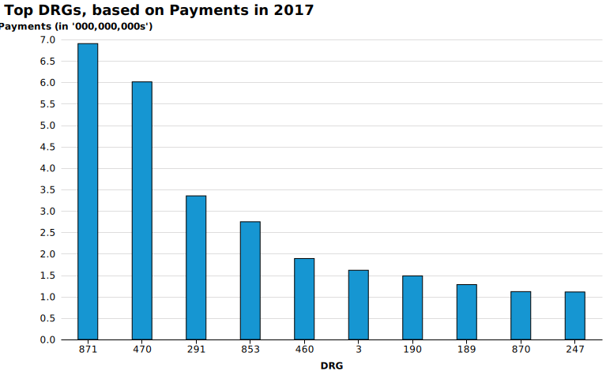
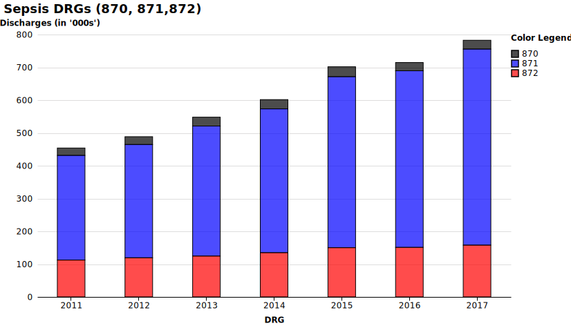

# Top DRGs  
Based on 2017 Discharges

 <em></em>
  
 
 

 

 
<em></em>

 

 

 
<em></em>

 

 <em></em>
  
 
 

 
Top DRGs for 2017

 

1.  [871 - SEPTICEMIA OR SEVERE SEPSIS W/O MV >96 HOURS W MCC](http://mvigoda.github.io/datasets/Discharges/1_871_Chart.html)  
2.  [470 - MAJOR JOINT REPLACEMENT OR REATTACHMENT OF LOWER EXTREMITY W/O MCC](http://mvigoda.github.io/datasets/Discharges/2_470_Chart.html)  
3.  [291 - HEART FAILURE & SHOCK W MCC](http://mvigoda.github.io/datasets/Discharges/3_291_Chart.html)  
4.  [190 - CHRONIC OBSTRUCTIVE PULMONARY DISEASE W MCC](http://mvigoda.github.io/datasets/Discharges/4_190_Chart.html)  
5.  [189 - PULMONARY EDEMA & RESPIRATORY FAILURE](http://mvigoda.github.io/datasets/Discharges/5_189_Chart.html)  
6.  [872 - SEPTICEMIA OR SEVERE SEPSIS W/O MV >96 HOURS W/O MCC](http://mvigoda.github.io/datasets/Discharges/6_872_Chart.html)  
7.  [392 - ESOPHAGITIS, GASTROENT & MISC DIGEST DISORDERS W/O MCC](http://mvigoda.github.io/datasets/Discharges/7_392_Chart.html)  
8.  [690 - KIDNEY & URINARY TRACT INFECTIONS W/O MCC](http://mvigoda.github.io/datasets/Discharges/8_690_Chart.html)  
9.  [683 - RENAL FAILURE W CC](http://mvigoda.github.io/datasets/Discharges/9_683_Chart.html)  
10.  [378 - G.I. HEMORRHAGE W CC](http://mvigoda.github.io/datasets/Discharges/10_378_Chart.html)  
11.  [682 - RENAL FAILURE W MCC](http://mvigoda.github.io/datasets/Discharges/11_682_Chart.html)  
12.  [065 - INTRACRANIAL HEMORRHAGE OR CEREBRAL INFARCTION W CC OR TPA IN 24 HRS](http://mvigoda.github.io/datasets/Discharges/12_65_Chart.html)  
13.  [603 - CELLULITIS W/O MCC](http://mvigoda.github.io/datasets/Discharges/13_603_Chart.html)  
14.  [292 - HEART FAILURE & SHOCK W CC](http://mvigoda.github.io/datasets/Discharges/14_292_Chart.html)  
15.  [193 - SIMPLE PNEUMONIA & PLEURISY W MCC](http://mvigoda.github.io/datasets/Discharges/15_193_Chart.html)  
16.  [194 - SIMPLE PNEUMONIA & PLEURISY W CC](http://mvigoda.github.io/datasets/Discharges/16_194_Chart.html)  
17.  [309 - CARDIAC ARRHYTHMIA & CONDUCTION DISORDERS W CC](http://mvigoda.github.io/datasets/Discharges/17_309_Chart.html)  
18.  [247 - PERC CARDIOVASC PROC W DRUG-ELUTING STENT W/O MCC](http://mvigoda.github.io/datasets/Discharges/18_247_Chart.html)  
19.  [191 - CHRONIC OBSTRUCTIVE PULMONARY DISEASE W CC](http://mvigoda.github.io/datasets/Discharges/19_191_Chart.html)  
20.  [641 - MISC DISORDERS OF NUTRITION,METABOLISM,FLUIDS/ELECTROLYTES W/O MCC](http://mvigoda.github.io/datasets/Discharges/20_641_Chart.html)  

[Stocks](http://mvigoda.github.io/datasets/stocks.html)  

[Chart](http://mvigoda.github.io/chart.html)

