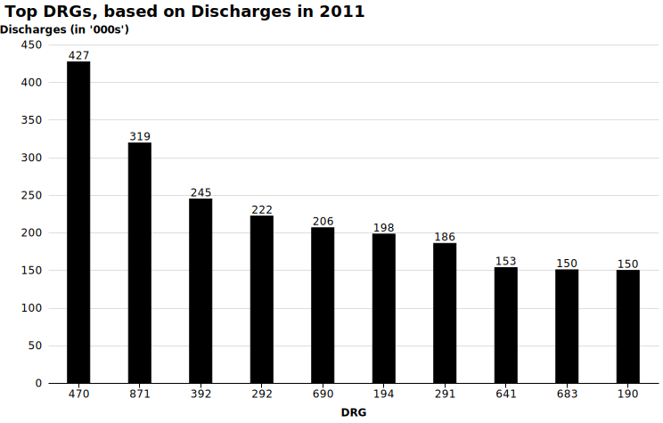
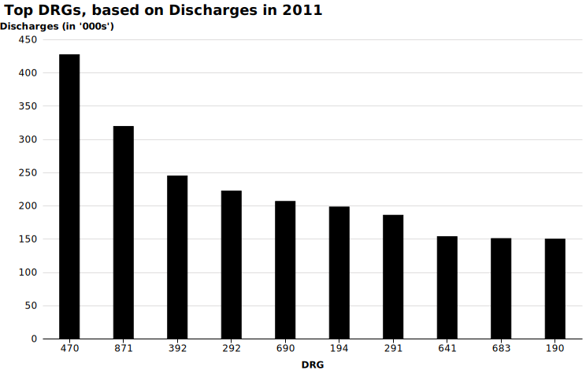

# Top DRGs for 2011 - Discharges

 

 
<em></em>

 

 
<em></em>

 

1.  470 - MAJOR JOINT REPLACEMENT OR REATTACHMENT OF LOWER EXTREMITY W/O MCC  
[Drop_Down](http://mvigoda.github.io/datasets/Year_2011/2011_Charts/2011_1_470_Chart.html)   &nbsp; &nbsp; &nbsp; &nbsp;  [Radio_Button](http://mvigoda.github.io/datasets/Year_2011/2011_Charts/2011_1_470_radio_button_Chart.html)  

2.  871 - SEPTICEMIA OR SEVERE SEPSIS W/O MV >96 HOURS W MCC  
[Drop_Down](http://mvigoda.github.io/datasets/Year_2011/2011_Charts/2011_2_871_Chart.html)   &nbsp; &nbsp; &nbsp; &nbsp;  [Radio_Button](http://mvigoda.github.io/datasets/Year_2011/2011_Charts/2011_2_871_radio_button_Chart.html)  

3.  392 - ESOPHAGITIS, GASTROENT & MISC DIGEST DISORDERS W/O MCC  
[Drop_Down](http://mvigoda.github.io/datasets/Year_2011/2011_Charts/2011_3_392_Chart.html)   &nbsp; &nbsp; &nbsp; &nbsp;  [Radio_Button](http://mvigoda.github.io/datasets/Year_2011/2011_Charts/2011_3_392_radio_button_Chart.html)  

4.  292 - HEART FAILURE & SHOCK W CC  
[Drop_Down](http://mvigoda.github.io/datasets/Year_2011/2011_Charts/2011_4_292_Chart.html)   &nbsp; &nbsp; &nbsp; &nbsp;  [Radio_Button](http://mvigoda.github.io/datasets/Year_2011/2011_Charts/2011_4_292_radio_button_Chart.html)  

5.  690 - KIDNEY & URINARY TRACT INFECTIONS W/O MCC  
[Drop_Down](http://mvigoda.github.io/datasets/Year_2011/2011_Charts/2011_5_690_Chart.html)   &nbsp; &nbsp; &nbsp; &nbsp;  [Radio_Button](http://mvigoda.github.io/datasets/Year_2011/2011_Charts/2011_5_690_radio_button_Chart.html)  

6.  194 - SIMPLE PNEUMONIA & PLEURISY W CC  
[Drop_Down](http://mvigoda.github.io/datasets/Year_2011/2011_Charts/2011_6_194_Chart.html)   &nbsp; &nbsp; &nbsp; &nbsp;  [Radio_Button](http://mvigoda.github.io/datasets/Year_2011/2011_Charts/2011_6_194_radio_button_Chart.html)  

7.  291 - HEART FAILURE & SHOCK W MCC  
[Drop_Down](http://mvigoda.github.io/datasets/Year_2011/2011_Charts/2011_7_291_Chart.html)   &nbsp; &nbsp; &nbsp; &nbsp;  [Radio_Button](http://mvigoda.github.io/datasets/Year_2011/2011_Charts/2011_7_291_radio_button_Chart.html)  

8.  641 - MISC DISORDERS OF NUTRITION,METABOLISM,FLUIDS/ELECTROLYTES W/O MCC  
[Drop_Down](http://mvigoda.github.io/datasets/Year_2011/2011_Charts/2011_8_641_Chart.html)   &nbsp; &nbsp; &nbsp; &nbsp;  [Radio_Button](http://mvigoda.github.io/datasets/Year_2011/2011_Charts/2011_8_641_radio_button_Chart.html)  

9.  683 - RENAL FAILURE W CC  
[Drop_Down](http://mvigoda.github.io/datasets/Year_2011/2011_Charts/2011_9_683_Chart.html)   &nbsp; &nbsp; &nbsp; &nbsp;  [Radio_Button](http://mvigoda.github.io/datasets/Year_2011/2011_Charts/2011_9_683_radio_button_Chart.html)  

10.  190 - CHRONIC OBSTRUCTIVE PULMONARY DISEASE W MCC  
[Drop_Down](http://mvigoda.github.io/datasets/Year_2011/2011_Charts/2011_10_190_Chart.html)   &nbsp; &nbsp; &nbsp; &nbsp;  [Radio_Button](http://mvigoda.github.io/datasets/Year_2011/2011_Charts/2011_10_190_radio_button_Chart.html)  

11.  191 - CHRONIC OBSTRUCTIVE PULMONARY DISEASE W CC  
[Drop_Down](http://mvigoda.github.io/datasets/Year_2011/2011_Charts/2011_11_191_Chart.html)   &nbsp; &nbsp; &nbsp; &nbsp;  [Radio_Button](http://mvigoda.github.io/datasets/Year_2011/2011_Charts/2011_11_191_radio_button_Chart.html)  

12.  312 - SYNCOPE & COLLAPSE  
[Drop_Down](http://mvigoda.github.io/datasets/Year_2011/2011_Charts/2011_12_312_Chart.html)   &nbsp; &nbsp; &nbsp; &nbsp;  [Radio_Button](http://mvigoda.github.io/datasets/Year_2011/2011_Charts/2011_12_312_radio_button_Chart.html)  

13.  603 - CELLULITIS W/O MCC  
[Drop_Down](http://mvigoda.github.io/datasets/Year_2011/2011_Charts/2011_13_603_Chart.html)   &nbsp; &nbsp; &nbsp; &nbsp;  [Radio_Button](http://mvigoda.github.io/datasets/Year_2011/2011_Charts/2011_13_603_radio_button_Chart.html)  

14.  378 - G.I. HEMORRHAGE W CC  
[Drop_Down](http://mvigoda.github.io/datasets/Year_2011/2011_Charts/2011_14_378_Chart.html)   &nbsp; &nbsp; &nbsp; &nbsp;  [Radio_Button](http://mvigoda.github.io/datasets/Year_2011/2011_Charts/2011_14_378_radio_button_Chart.html)  

15.  313 - CHEST PAIN  
[Drop_Down](http://mvigoda.github.io/datasets/Year_2011/2011_Charts/2011_15_313_Chart.html)   &nbsp; &nbsp; &nbsp; &nbsp;  [Radio_Button](http://mvigoda.github.io/datasets/Year_2011/2011_Charts/2011_15_313_radio_button_Chart.html)  

16.  193 - SIMPLE PNEUMONIA & PLEURISY W MCC  
[Drop_Down](http://mvigoda.github.io/datasets/Year_2011/2011_Charts/2011_16_193_Chart.html)   &nbsp; &nbsp; &nbsp; &nbsp;  [Radio_Button](http://mvigoda.github.io/datasets/Year_2011/2011_Charts/2011_16_193_radio_button_Chart.html)  

17.  287 - CIRCULATORY DISORDERS EXCEPT AMI, W CARD CATH W/O MCC  
[Drop_Down](http://mvigoda.github.io/datasets/Year_2011/2011_Charts/2011_17_287_Chart.html)   &nbsp; &nbsp; &nbsp; &nbsp;  [Radio_Button](http://mvigoda.github.io/datasets/Year_2011/2011_Charts/2011_17_287_radio_button_Chart.html)  

18.  192 - CHRONIC OBSTRUCTIVE PULMONARY DISEASE W/O CC/MCC  
[Drop_Down](http://mvigoda.github.io/datasets/Year_2011/2011_Charts/2011_18_192_Chart.html)   &nbsp; &nbsp; &nbsp; &nbsp;  [Radio_Button](http://mvigoda.github.io/datasets/Year_2011/2011_Charts/2011_18_192_radio_button_Chart.html)  

19.  310 - CARDIAC ARRHYTHMIA & CONDUCTION DISORDERS W/O CC/MCC  
[Drop_Down](http://mvigoda.github.io/datasets/Year_2011/2011_Charts/2011_19_310_Chart.html)   &nbsp; &nbsp; &nbsp; &nbsp;  [Radio_Button](http://mvigoda.github.io/datasets/Year_2011/2011_Charts/2011_19_310_radio_button_Chart.html)  

20.  872 - SEPTICEMIA OR SEVERE SEPSIS W/O MV >96 HOURS W/O MCC  
[Drop_Down](http://mvigoda.github.io/datasets/Year_2011/2011_Charts/2011_20_872_Chart.html)   &nbsp; &nbsp; &nbsp; &nbsp;  [Radio_Button](http://mvigoda.github.io/datasets/Year_2011/2011_Charts/2011_20_872_radio_button_Chart.html)  

 
 
 
 
 
[2011](http://mvigoda.github.io/datasets/Discharges/Discharges_labels_2011.svg)  

[2011 no labels](http://mvigoda.github.io/datasets/Discharges/Discharges_2011.svg)  

 

