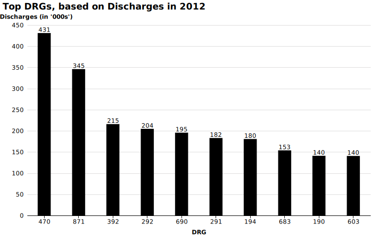

# Top DRGs for 2012 - Discharges

Top_Discharges_2012.md
 

 
<em></em>

 

 
<em></em>

 

1.  470 - MAJOR JOINT REPLACEMENT OR REATTACHMENT OF LOWER EXTREMITY W/O MCC  
[Drop_Down](http://mvigoda.github.io/datasets/Year_2012/2012_Charts/2012_1_470_Chart.html)   &nbsp; &nbsp; &nbsp; &nbsp;  [Radio_Button](http://mvigoda.github.io/datasets/Year_2012/2012_Charts/2012_1_470_radio_button_Chart.html)  

2.  871 - SEPTICEMIA OR SEVERE SEPSIS W/O MV >96 HOURS W MCC  
[Drop_Down](http://mvigoda.github.io/datasets/Year_2012/2012_Charts/2012_2_871_Chart.html)   &nbsp; &nbsp; &nbsp; &nbsp;  [Radio_Button](http://mvigoda.github.io/datasets/Year_2012/2012_Charts/2012_2_871_radio_button_Chart.html)  

3.  392 - ESOPHAGITIS, GASTROENT & MISC DIGEST DISORDERS W/O MCC  
[Drop_Down](http://mvigoda.github.io/datasets/Year_2012/2012_Charts/2012_3_392_Chart.html)   &nbsp; &nbsp; &nbsp; &nbsp;  [Radio_Button](http://mvigoda.github.io/datasets/Year_2012/2012_Charts/2012_3_392_radio_button_Chart.html)  

4.  292 - HEART FAILURE & SHOCK W CC  
[Drop_Down](http://mvigoda.github.io/datasets/Year_2012/2012_Charts/2012_4_292_Chart.html)   &nbsp; &nbsp; &nbsp; &nbsp;  [Radio_Button](http://mvigoda.github.io/datasets/Year_2012/2012_Charts/2012_4_292_radio_button_Chart.html)  

5.  690 - KIDNEY & URINARY TRACT INFECTIONS W/O MCC  
[Drop_Down](http://mvigoda.github.io/datasets/Year_2012/2012_Charts/2012_5_690_Chart.html)   &nbsp; &nbsp; &nbsp; &nbsp;  [Radio_Button](http://mvigoda.github.io/datasets/Year_2012/2012_Charts/2012_5_690_radio_button_Chart.html)  

6.  291 - HEART FAILURE & SHOCK W MCC  
[Drop_Down](http://mvigoda.github.io/datasets/Year_2012/2012_Charts/2012_6_291_Chart.html)   &nbsp; &nbsp; &nbsp; &nbsp;  [Radio_Button](http://mvigoda.github.io/datasets/Year_2012/2012_Charts/2012_6_291_radio_button_Chart.html)  

7.  194 - SIMPLE PNEUMONIA & PLEURISY W CC  
[Drop_Down](http://mvigoda.github.io/datasets/Year_2012/2012_Charts/2012_7_194_Chart.html)   &nbsp; &nbsp; &nbsp; &nbsp;  [Radio_Button](http://mvigoda.github.io/datasets/Year_2012/2012_Charts/2012_7_194_radio_button_Chart.html)  

8.  683 - RENAL FAILURE W CC  
[Drop_Down](http://mvigoda.github.io/datasets/Year_2012/2012_Charts/2012_8_683_Chart.html)   &nbsp; &nbsp; &nbsp; &nbsp;  [Radio_Button](http://mvigoda.github.io/datasets/Year_2012/2012_Charts/2012_8_683_radio_button_Chart.html)  

9.  190 - CHRONIC OBSTRUCTIVE PULMONARY DISEASE W MCC  
[Drop_Down](http://mvigoda.github.io/datasets/Year_2012/2012_Charts/2012_9_190_Chart.html)   &nbsp; &nbsp; &nbsp; &nbsp;  [Radio_Button](http://mvigoda.github.io/datasets/Year_2012/2012_Charts/2012_9_190_radio_button_Chart.html)  

10.  603 - CELLULITIS W/O MCC  
[Drop_Down](http://mvigoda.github.io/datasets/Year_2012/2012_Charts/2012_10_603_Chart.html)   &nbsp; &nbsp; &nbsp; &nbsp;  [Radio_Button](http://mvigoda.github.io/datasets/Year_2012/2012_Charts/2012_10_603_radio_button_Chart.html)  

11.  378 - G.I. HEMORRHAGE W CC  
[Drop_Down](http://mvigoda.github.io/datasets/Year_2012/2012_Charts/2012_11_378_Chart.html)   &nbsp; &nbsp; &nbsp; &nbsp;  [Radio_Button](http://mvigoda.github.io/datasets/Year_2012/2012_Charts/2012_11_378_radio_button_Chart.html)  

12.  191 - CHRONIC OBSTRUCTIVE PULMONARY DISEASE W CC  
[Drop_Down](http://mvigoda.github.io/datasets/Year_2012/2012_Charts/2012_12_191_Chart.html)   &nbsp; &nbsp; &nbsp; &nbsp;  [Radio_Button](http://mvigoda.github.io/datasets/Year_2012/2012_Charts/2012_12_191_radio_button_Chart.html)  

13.  641 - MISC DISORDERS OF NUTRITION,METABOLISM,FLUIDS/ELECTROLYTES W/O MCC  
[Drop_Down](http://mvigoda.github.io/datasets/Year_2012/2012_Charts/2012_13_641_Chart.html)   &nbsp; &nbsp; &nbsp; &nbsp;  [Radio_Button](http://mvigoda.github.io/datasets/Year_2012/2012_Charts/2012_13_641_radio_button_Chart.html)  

14.  193 - SIMPLE PNEUMONIA & PLEURISY W MCC  
[Drop_Down](http://mvigoda.github.io/datasets/Year_2012/2012_Charts/2012_14_193_Chart.html)   &nbsp; &nbsp; &nbsp; &nbsp;  [Radio_Button](http://mvigoda.github.io/datasets/Year_2012/2012_Charts/2012_14_193_radio_button_Chart.html)  

15.  872 - SEPTICEMIA OR SEVERE SEPSIS W/O MV >96 HOURS W/O MCC  
[Drop_Down](http://mvigoda.github.io/datasets/Year_2012/2012_Charts/2012_15_872_Chart.html)   &nbsp; &nbsp; &nbsp; &nbsp;  [Radio_Button](http://mvigoda.github.io/datasets/Year_2012/2012_Charts/2012_15_872_radio_button_Chart.html)  

16.  312 - SYNCOPE & COLLAPSE  
[Drop_Down](http://mvigoda.github.io/datasets/Year_2012/2012_Charts/2012_16_312_Chart.html)   &nbsp; &nbsp; &nbsp; &nbsp;  [Radio_Button](http://mvigoda.github.io/datasets/Year_2012/2012_Charts/2012_16_312_radio_button_Chart.html)  

17.  310 - CARDIAC ARRHYTHMIA & CONDUCTION DISORDERS W/O CC/MCC  
[Drop_Down](http://mvigoda.github.io/datasets/Year_2012/2012_Charts/2012_17_310_Chart.html)   &nbsp; &nbsp; &nbsp; &nbsp;  [Radio_Button](http://mvigoda.github.io/datasets/Year_2012/2012_Charts/2012_17_310_radio_button_Chart.html)  

18.  287 - CIRCULATORY DISORDERS EXCEPT AMI, W CARD CATH W/O MCC  
[Drop_Down](http://mvigoda.github.io/datasets/Year_2012/2012_Charts/2012_18_287_Chart.html)   &nbsp; &nbsp; &nbsp; &nbsp;  [Radio_Button](http://mvigoda.github.io/datasets/Year_2012/2012_Charts/2012_18_287_radio_button_Chart.html)  

19.  682 - RENAL FAILURE W MCC  
[Drop_Down](http://mvigoda.github.io/datasets/Year_2012/2012_Charts/2012_19_682_Chart.html)   &nbsp; &nbsp; &nbsp; &nbsp;  [Radio_Button](http://mvigoda.github.io/datasets/Year_2012/2012_Charts/2012_19_682_radio_button_Chart.html)  

20.  065 - INTRACRANIAL HEMORRHAGE OR CEREBRAL INFARCTION W CC OR TPA IN 24 HRS  
[Drop_Down](http://mvigoda.github.io/datasets/Year_2012/2012_Charts/2012_20_65_Chart.html)   &nbsp; &nbsp; &nbsp; &nbsp;  [Radio_Button](http://mvigoda.github.io/datasets/Year_2012/2012_Charts/2012_20_65_radio_button_Chart.html)  

 
 
 
[2011](http://mvigoda.github.io/datasets/Discharges/Discharges_labels_2011.svg)  

[2011 no labels](http://mvigoda.github.io/datasets/Discharges/Discharges_2011.svg)  

 

