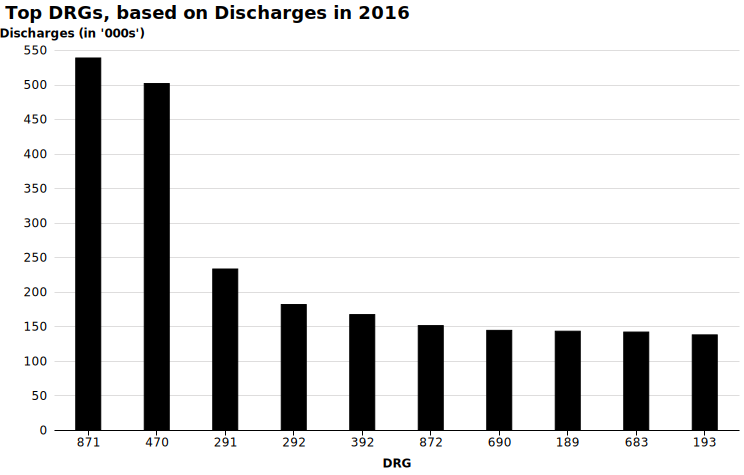

# Top DRGs for 2016 - Discharges

 

 
<em></em>

 
<em></em>

 

1.  871 - SEPTICEMIA OR SEVERE SEPSIS W/O MV >96 HOURS W MCC  
[Drop_Down](http://mvigoda.github.io/datasets/Year_2016/2016_Charts/2016_1_871_Chart.html)   &nbsp; &nbsp; &nbsp; &nbsp;  [Radio_Button](http://mvigoda.github.io/datasets/Year_2016/2016_Charts/2016_1_871_radio_button_Chart.html)  

2.  470 - MAJOR JOINT REPLACEMENT OR REATTACHMENT OF LOWER EXTREMITY W/O MCC  
[Drop_Down](http://mvigoda.github.io/datasets/Year_2016/2016_Charts/2016_2_470_Chart.html)   &nbsp; &nbsp; &nbsp; &nbsp;  [Radio_Button](http://mvigoda.github.io/datasets/Year_2016/2016_Charts/2016_2_470_radio_button_Chart.html)  

3.  291 - HEART FAILURE & SHOCK W MCC  
[Drop_Down](http://mvigoda.github.io/datasets/Year_2016/2016_Charts/2016_3_291_Chart.html)   &nbsp; &nbsp; &nbsp; &nbsp;  [Radio_Button](http://mvigoda.github.io/datasets/Year_2016/2016_Charts/2016_3_291_radio_button_Chart.html)  

4.  292 - HEART FAILURE & SHOCK W CC  
[Drop_Down](http://mvigoda.github.io/datasets/Year_2016/2016_Charts/2016_4_292_Chart.html)   &nbsp; &nbsp; &nbsp; &nbsp;  [Radio_Button](http://mvigoda.github.io/datasets/Year_2016/2016_Charts/2016_4_292_radio_button_Chart.html)  

5.  392 - ESOPHAGITIS, GASTROENT & MISC DIGEST DISORDERS W/O MCC  
[Drop_Down](http://mvigoda.github.io/datasets/Year_2016/2016_Charts/2016_5_392_Chart.html)   &nbsp; &nbsp; &nbsp; &nbsp;  [Radio_Button](http://mvigoda.github.io/datasets/Year_2016/2016_Charts/2016_5_392_radio_button_Chart.html)  

6.  872 - SEPTICEMIA OR SEVERE SEPSIS W/O MV >96 HOURS W/O MCC  
[Drop_Down](http://mvigoda.github.io/datasets/Year_2016/2016_Charts/2016_6_872_Chart.html)   &nbsp; &nbsp; &nbsp; &nbsp;  [Radio_Button](http://mvigoda.github.io/datasets/Year_2016/2016_Charts/2016_6_872_radio_button_Chart.html)  

7.  690 - KIDNEY & URINARY TRACT INFECTIONS W/O MCC  
[Drop_Down](http://mvigoda.github.io/datasets/Year_2016/2016_Charts/2016_7_690_Chart.html)   &nbsp; &nbsp; &nbsp; &nbsp;  [Radio_Button](http://mvigoda.github.io/datasets/Year_2016/2016_Charts/2016_7_690_radio_button_Chart.html)  

8.  189 - PULMONARY EDEMA & RESPIRATORY FAILURE  
[Drop_Down](http://mvigoda.github.io/datasets/Year_2016/2016_Charts/2016_8_189_Chart.html)   &nbsp; &nbsp; &nbsp; &nbsp;  [Radio_Button](http://mvigoda.github.io/datasets/Year_2016/2016_Charts/2016_8_189_radio_button_Chart.html)  

9.  683 - RENAL FAILURE W CC  
[Drop_Down](http://mvigoda.github.io/datasets/Year_2016/2016_Charts/2016_9_683_Chart.html)   &nbsp; &nbsp; &nbsp; &nbsp;  [Radio_Button](http://mvigoda.github.io/datasets/Year_2016/2016_Charts/2016_9_683_radio_button_Chart.html)  

10.  193 - SIMPLE PNEUMONIA & PLEURISY W MCC  
[Drop_Down](http://mvigoda.github.io/datasets/Year_2016/2016_Charts/2016_10_193_Chart.html)   &nbsp; &nbsp; &nbsp; &nbsp;  [Radio_Button](http://mvigoda.github.io/datasets/Year_2016/2016_Charts/2016_10_193_radio_button_Chart.html)  

11.  190 - CHRONIC OBSTRUCTIVE PULMONARY DISEASE W MCC  
[Drop_Down](http://mvigoda.github.io/datasets/Year_2016/2016_Charts/2016_11_190_Chart.html)   &nbsp; &nbsp; &nbsp; &nbsp;  [Radio_Button](http://mvigoda.github.io/datasets/Year_2016/2016_Charts/2016_11_190_radio_button_Chart.html)  

12.  378 - G.I. HEMORRHAGE W CC  
[Drop_Down](http://mvigoda.github.io/datasets/Year_2016/2016_Charts/2016_12_378_Chart.html)   &nbsp; &nbsp; &nbsp; &nbsp;  [Radio_Button](http://mvigoda.github.io/datasets/Year_2016/2016_Charts/2016_12_378_radio_button_Chart.html)  

13.  194 - SIMPLE PNEUMONIA & PLEURISY W CC  
[Drop_Down](http://mvigoda.github.io/datasets/Year_2016/2016_Charts/2016_13_194_Chart.html)   &nbsp; &nbsp; &nbsp; &nbsp;  [Radio_Button](http://mvigoda.github.io/datasets/Year_2016/2016_Charts/2016_13_194_radio_button_Chart.html)  

14.  682 - RENAL FAILURE W MCC  
[Drop_Down](http://mvigoda.github.io/datasets/Year_2016/2016_Charts/2016_14_682_Chart.html)   &nbsp; &nbsp; &nbsp; &nbsp;  [Radio_Button](http://mvigoda.github.io/datasets/Year_2016/2016_Charts/2016_14_682_radio_button_Chart.html)  

15.  603 - CELLULITIS W/O MCC  
[Drop_Down](http://mvigoda.github.io/datasets/Year_2016/2016_Charts/2016_15_603_Chart.html)   &nbsp; &nbsp; &nbsp; &nbsp;  [Radio_Button](http://mvigoda.github.io/datasets/Year_2016/2016_Charts/2016_15_603_radio_button_Chart.html)  

16.  065 - INTRACRANIAL HEMORRHAGE OR CEREBRAL INFARCTION W CC OR TPA IN 24 HRS  
[Drop_Down](http://mvigoda.github.io/datasets/Year_2016/2016_Charts/2016_16_65_Chart.html)   &nbsp; &nbsp; &nbsp; &nbsp;  [Radio_Button](http://mvigoda.github.io/datasets/Year_2016/2016_Charts/2016_16_65_radio_button_Chart.html)  

17.  641 - MISC DISORDERS OF NUTRITION,METABOLISM,FLUIDS/ELECTROLYTES W/O MCC  
[Drop_Down](http://mvigoda.github.io/datasets/Year_2016/2016_Charts/2016_17_641_Chart.html)   &nbsp; &nbsp; &nbsp; &nbsp;  [Radio_Button](http://mvigoda.github.io/datasets/Year_2016/2016_Charts/2016_17_641_radio_button_Chart.html)  

18.  191 - CHRONIC OBSTRUCTIVE PULMONARY DISEASE W CC  
[Drop_Down](http://mvigoda.github.io/datasets/Year_2016/2016_Charts/2016_18_191_Chart.html)   &nbsp; &nbsp; &nbsp; &nbsp;  [Radio_Button](http://mvigoda.github.io/datasets/Year_2016/2016_Charts/2016_18_191_radio_button_Chart.html)  

19.  309 - CARDIAC ARRHYTHMIA & CONDUCTION DISORDERS W CC  
[Drop_Down](http://mvigoda.github.io/datasets/Year_2016/2016_Charts/2016_19_309_Chart.html)   &nbsp; &nbsp; &nbsp; &nbsp;  [Radio_Button](http://mvigoda.github.io/datasets/Year_2016/2016_Charts/2016_19_309_radio_button_Chart.html)  

20.  853 - INFECTIOUS & PARASITIC DISEASES W O.R. PROCEDURE W MCC  
[Drop_Down](http://mvigoda.github.io/datasets/Year_2016/2016_Charts/2016_20_853_Chart.html)   &nbsp; &nbsp; &nbsp; &nbsp;  [Radio_Button](http://mvigoda.github.io/datasets/Year_2016/2016_Charts/2016_20_853_radio_button_Chart.html)  

        

 

1.  871 - SEPTICEMIA OR SEVERE SEPSIS W/O MV >96 HOURS W MCC    
[Drop Down](http://mvigoda.github.io/datasets/Year_2016/2016_Charts/2016_1_871_Chart.html)  &nbsp; &nbsp; &nbsp; &nbsp;   [Radio Button](http://mvigoda.github.io/datasets/Year_2016/2016_Charts/2016_1_871_radio_button_Chart.html)  

2.  [470 - MAJOR JOINT REPLACEMENT OR REATTACHMENT OF LOWER EXTREMITY W/O MCC](http://mvigoda.github.io/datasets/Year_2016/2016_Charts/2016_2_470_Chart.html)  
3.  [291 - HEART FAILURE & SHOCK W MCC](http://mvigoda.github.io/datasets/Year_2016/2016_Charts/2016_3_291_Chart.html)  
4.  [292 - HEART FAILURE & SHOCK W CC](http://mvigoda.github.io/datasets/Year_2016/2016_Charts/2016_4_292_Chart.html)  
5.  [392 - ESOPHAGITIS, GASTROENT & MISC DIGEST DISORDERS W/O MCC](http://mvigoda.github.io/datasets/Year_2016/2016_Charts/2016_5_392_Chart.html)  
6.  [872 - SEPTICEMIA OR SEVERE SEPSIS W/O MV >96 HOURS W/O MCC](http://mvigoda.github.io/datasets/Year_2016/2016_Charts/2016_6_872_Chart.html)  
7.  [690 - KIDNEY & URINARY TRACT INFECTIONS W/O MCC](http://mvigoda.github.io/datasets/Year_2016/2016_Charts/2016_7_690_Chart.html)  
8.  [189 - PULMONARY EDEMA & RESPIRATORY FAILURE](http://mvigoda.github.io/datasets/Year_2016/2016_Charts/2016_8_189_Chart.html)  
9.  [683 - RENAL FAILURE W CC](http://mvigoda.github.io/datasets/Year_2016/2016_Charts/2016_9_683_Chart.html)  
10.  [193 - SIMPLE PNEUMONIA & PLEURISY W MCC](http://mvigoda.github.io/datasets/Year_2016/2016_Charts/2016_10_193_Chart.html)  
11.  [190 - CHRONIC OBSTRUCTIVE PULMONARY DISEASE W MCC](http://mvigoda.github.io/datasets/Year_2016/2016_Charts/2016_11_190_Chart.html)  
12.  [378 - G.I. HEMORRHAGE W CC](http://mvigoda.github.io/datasets/Year_2016/2016_Charts/2016_12_378_Chart.html)  
13.  [194 - SIMPLE PNEUMONIA & PLEURISY W CC](http://mvigoda.github.io/datasets/Year_2016/2016_Charts/2016_13_194_Chart.html)  
14.  [682 - RENAL FAILURE W MCC](http://mvigoda.github.io/datasets/Year_2016/2016_Charts/2016_14_682_Chart.html)  
15.  [603 - CELLULITIS W/O MCC](http://mvigoda.github.io/datasets/Year_2016/2016_Charts/2016_15_603_Chart.html)  
16.  [065 - INTRACRANIAL HEMORRHAGE OR CEREBRAL INFARCTION W CC OR TPA IN 24 HRS](http://mvigoda.github.io/datasets/Year_2016/2016_Charts/2016_16_65_Chart.html)  
17.  [641 - MISC DISORDERS OF NUTRITION,METABOLISM,FLUIDS/ELECTROLYTES W/O MCC](http://mvigoda.github.io/datasets/Year_2016/2016_Charts/2016_17_641_Chart.html)  
18.  [191 - CHRONIC OBSTRUCTIVE PULMONARY DISEASE W CC](http://mvigoda.github.io/datasets/Year_2016/2016_Charts/2016_18_191_Chart.html)  
19.  [309 - CARDIAC ARRHYTHMIA & CONDUCTION DISORDERS W CC](http://mvigoda.github.io/datasets/Year_2016/2016_Charts/2016_19_309_Chart.html)  
20.  [853 - INFECTIOUS & PARASITIC DISEASES W O.R. PROCEDURE W MCC](http://mvigoda.github.io/datasets/Year_2016/2016_Charts/2016_20_853_Chart.html)  

## Radio Buttons

1.  [871 - SEPTICEMIA OR SEVERE SEPSIS W/O MV >96 HOURS W MCC](http://mvigoda.github.io/datasets/Year_2016/2016_Charts/2016_1_871_radio_button_Chart.html)  
2.  [470 - MAJOR JOINT REPLACEMENT OR REATTACHMENT OF LOWER EXTREMITY W/O MCC](http://mvigoda.github.io/datasets/Year_2016/2016_Charts/2016_2_470_radio_button_Chart.html)  
3.  [291 - HEART FAILURE & SHOCK W MCC](http://mvigoda.github.io/datasets/Year_2016/2016_Charts/2016_3_291_radio_button_Chart.html)  
4.  [292 - HEART FAILURE & SHOCK W CC](http://mvigoda.github.io/datasets/Year_2016/2016_Charts/2016_4_292_radio_button_Chart.html)  
5.  [392 - ESOPHAGITIS, GASTROENT & MISC DIGEST DISORDERS W/O MCC](http://mvigoda.github.io/datasets/Year_2016/2016_Charts/2016_5_392_radio_button_Chart.html)  
6.  [872 - SEPTICEMIA OR SEVERE SEPSIS W/O MV >96 HOURS W/O MCC](http://mvigoda.github.io/datasets/Year_2016/2016_Charts/2016_6_872_radio_button_Chart.html)  
7.  [690 - KIDNEY & URINARY TRACT INFECTIONS W/O MCC](http://mvigoda.github.io/datasets/Year_2016/2016_Charts/2016_7_690_radio_button_Chart.html)  
8.  [189 - PULMONARY EDEMA & RESPIRATORY FAILURE](http://mvigoda.github.io/datasets/Year_2016/2016_Charts/2016_8_189_radio_button_Chart.html)  
9.  [683 - RENAL FAILURE W CC](http://mvigoda.github.io/datasets/Year_2016/2016_Charts/2016_9_683_radio_button_Chart.html)  
10.  [193 - SIMPLE PNEUMONIA & PLEURISY W MCC](http://mvigoda.github.io/datasets/Year_2016/2016_Charts/2016_10_193_radio_button_Chart.html)  
11.  [190 - CHRONIC OBSTRUCTIVE PULMONARY DISEASE W MCC](http://mvigoda.github.io/datasets/Year_2016/2016_Charts/2016_11_190_radio_button_Chart.html)  
12.  [378 - G.I. HEMORRHAGE W CC](http://mvigoda.github.io/datasets/Year_2016/2016_Charts/2016_12_378_radio_button_Chart.html)  
13.  [194 - SIMPLE PNEUMONIA & PLEURISY W CC](http://mvigoda.github.io/datasets/Year_2016/2016_Charts/2016_13_194_radio_button_Chart.html)  
14.  [682 - RENAL FAILURE W MCC](http://mvigoda.github.io/datasets/Year_2016/2016_Charts/2016_14_682_radio_button_Chart.html)  
15.  [603 - CELLULITIS W/O MCC](http://mvigoda.github.io/datasets/Year_2016/2016_Charts/2016_15_603_radio_button_Chart.html)  
16.  [065 - INTRACRANIAL HEMORRHAGE OR CEREBRAL INFARCTION W CC OR TPA IN 24 HRS](http://mvigoda.github.io/datasets/Year_2016/2016_Charts/2016_16_65_radio_button_Chart.html)  
17.  [641 - MISC DISORDERS OF NUTRITION,METABOLISM,FLUIDS/ELECTROLYTES W/O MCC](http://mvigoda.github.io/datasets/Year_2016/2016_Charts/2016_17_641_radio_button_Chart.html)  
18.  [191 - CHRONIC OBSTRUCTIVE PULMONARY DISEASE W CC](http://mvigoda.github.io/datasets/Year_2016/2016_Charts/2016_18_191_radio_button_Chart.html)  
19.  [309 - CARDIAC ARRHYTHMIA & CONDUCTION DISORDERS W CC](http://mvigoda.github.io/datasets/Year_2016/2016_Charts/2016_19_309_radio_button_Chart.html)  
20.  [853 - INFECTIOUS & PARASITIC DISEASES W O.R. PROCEDURE W MCC](http://mvigoda.github.io/datasets/Year_2016/2016_Charts/2016_20_853_radio_button_Chart.html)  

[2011](http://mvigoda.github.io/datasets/Discharges/Discharges_labels_2011.svg)  

[2011 no labels](http://mvigoda.github.io/datasets/Discharges/Discharges_2011.svg)  

