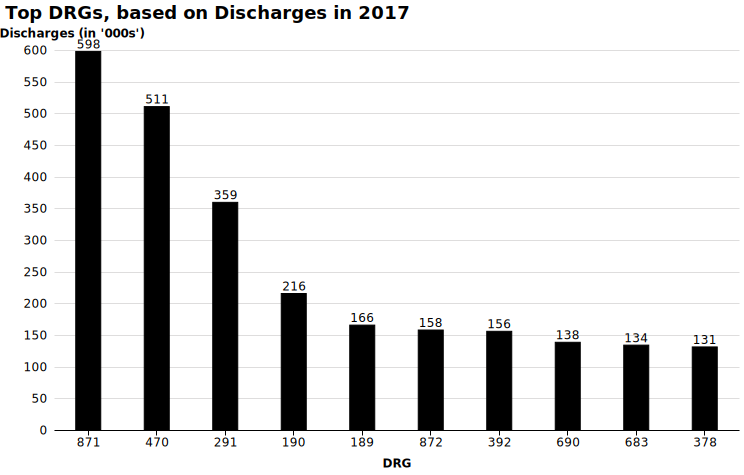

# Top DRGs for 2017 - Discharges

 

 
<em></em>

 

 
<em></em>

 

1.  871 - SEPTICEMIA OR SEVERE SEPSIS W/O MV >96 HOURS W MCC  
[Drop_Down](http://mvigoda.github.io/datasets/Year_2017/2017_Charts/2017_1_871_Chart.html)   &nbsp; &nbsp; &nbsp; &nbsp;  [Radio_Button](http://mvigoda.github.io/datasets/Year_2017/2017_Charts/2017_1_871_radio_button_Chart.html)  

2.  470 - MAJOR JOINT REPLACEMENT OR REATTACHMENT OF LOWER EXTREMITY W/O MCC  
[Drop_Down](http://mvigoda.github.io/datasets/Year_2017/2017_Charts/2017_2_470_Chart.html)   &nbsp; &nbsp; &nbsp; &nbsp;  [Radio_Button](http://mvigoda.github.io/datasets/Year_2017/2017_Charts/2017_2_470_radio_button_Chart.html)  

3.  291 - HEART FAILURE & SHOCK W MCC  
[Drop_Down](http://mvigoda.github.io/datasets/Year_2017/2017_Charts/2017_3_291_Chart.html)   &nbsp; &nbsp; &nbsp; &nbsp;  [Radio_Button](http://mvigoda.github.io/datasets/Year_2017/2017_Charts/2017_3_291_radio_button_Chart.html)  

4.  190 - CHRONIC OBSTRUCTIVE PULMONARY DISEASE W MCC  
[Drop_Down](http://mvigoda.github.io/datasets/Year_2017/2017_Charts/2017_4_190_Chart.html)   &nbsp; &nbsp; &nbsp; &nbsp;  [Radio_Button](http://mvigoda.github.io/datasets/Year_2017/2017_Charts/2017_4_190_radio_button_Chart.html)  

5.  189 - PULMONARY EDEMA & RESPIRATORY FAILURE  
[Drop_Down](http://mvigoda.github.io/datasets/Year_2017/2017_Charts/2017_5_189_Chart.html)   &nbsp; &nbsp; &nbsp; &nbsp;  [Radio_Button](http://mvigoda.github.io/datasets/Year_2017/2017_Charts/2017_5_189_radio_button_Chart.html)  

6.  872 - SEPTICEMIA OR SEVERE SEPSIS W/O MV >96 HOURS W/O MCC  
[Drop_Down](http://mvigoda.github.io/datasets/Year_2017/2017_Charts/2017_6_872_Chart.html)   &nbsp; &nbsp; &nbsp; &nbsp;  [Radio_Button](http://mvigoda.github.io/datasets/Year_2017/2017_Charts/2017_6_872_radio_button_Chart.html)  

7.  392 - ESOPHAGITIS, GASTROENT & MISC DIGEST DISORDERS W/O MCC  
[Drop_Down](http://mvigoda.github.io/datasets/Year_2017/2017_Charts/2017_7_392_Chart.html)   &nbsp; &nbsp; &nbsp; &nbsp;  [Radio_Button](http://mvigoda.github.io/datasets/Year_2017/2017_Charts/2017_7_392_radio_button_Chart.html)  

8.  690 - KIDNEY & URINARY TRACT INFECTIONS W/O MCC  
[Drop_Down](http://mvigoda.github.io/datasets/Year_2017/2017_Charts/2017_8_690_Chart.html)   &nbsp; &nbsp; &nbsp; &nbsp;  [Radio_Button](http://mvigoda.github.io/datasets/Year_2017/2017_Charts/2017_8_690_radio_button_Chart.html)  

9.  683 - RENAL FAILURE W CC  
[Drop_Down](http://mvigoda.github.io/datasets/Year_2017/2017_Charts/2017_9_683_Chart.html)   &nbsp; &nbsp; &nbsp; &nbsp;  [Radio_Button](http://mvigoda.github.io/datasets/Year_2017/2017_Charts/2017_9_683_radio_button_Chart.html)  

 10.  378 - G.I. HEMORRHAGE W CC  
[Drop_Down](http://mvigoda.github.io/datasets/Year_2017/2017_Charts/2017_10_378_Chart.html)   &nbsp; &nbsp; &nbsp; &nbsp;  [Radio_Button](http://mvigoda.github.io/datasets/Year_2017/2017_Charts/2017_10_378_radio_button_Chart.html)  

11.  682 - RENAL FAILURE W MCC  
[Drop_Down](http://mvigoda.github.io/datasets/Year_2017/2017_Charts/2017_11_682_Chart.html)   &nbsp; &nbsp; &nbsp; &nbsp;  [Radio_Button](http://mvigoda.github.io/datasets/Year_2017/2017_Charts/2017_11_682_radio_button_Chart.html)  

12.  065 - INTRACRANIAL HEMORRHAGE OR CEREBRAL INFARCTION W CC OR TPA IN 24 HRS  
[Drop_Down](http://mvigoda.github.io/datasets/Year_2017/2017_Charts/2017_12_65_Chart.html)   &nbsp; &nbsp; &nbsp; &nbsp;  [Radio_Button](http://mvigoda.github.io/datasets/Year_2017/2017_Charts/2017_12_65_radio_button_Chart.html)  

13.  603 - CELLULITIS W/O MCC  
[Drop_Down](http://mvigoda.github.io/datasets/Year_2017/2017_Charts/2017_13_603_Chart.html)   &nbsp; &nbsp; &nbsp; &nbsp;  [Radio_Button](http://mvigoda.github.io/datasets/Year_2017/2017_Charts/2017_13_603_radio_button_Chart.html)  

14.  292 - HEART FAILURE & SHOCK W CC  
[Drop_Down](http://mvigoda.github.io/datasets/Year_2017/2017_Charts/2017_14_292_Chart.html)   &nbsp; &nbsp; &nbsp; &nbsp;  [Radio_Button](http://mvigoda.github.io/datasets/Year_2017/2017_Charts/2017_14_292_radio_button_Chart.html)  

15.  193 - SIMPLE PNEUMONIA & PLEURISY W MCC  
[Drop_Down](http://mvigoda.github.io/datasets/Year_2017/2017_Charts/2017_15_193_Chart.html)   &nbsp; &nbsp; &nbsp; &nbsp;  [Radio_Button](http://mvigoda.github.io/datasets/Year_2017/2017_Charts/2017_15_193_radio_button_Chart.html)  

16.  194 - SIMPLE PNEUMONIA & PLEURISY W CC  
[Drop_Down](http://mvigoda.github.io/datasets/Year_2017/2017_Charts/2017_16_194_Chart.html)   &nbsp; &nbsp; &nbsp; &nbsp;  [Radio_Button](http://mvigoda.github.io/datasets/Year_2017/2017_Charts/2017_16_194_radio_button_Chart.html)  

17.  309 - CARDIAC ARRHYTHMIA & CONDUCTION DISORDERS W CC  
[Drop_Down](http://mvigoda.github.io/datasets/Year_2017/2017_Charts/2017_17_309_Chart.html)   &nbsp; &nbsp; &nbsp; &nbsp;  [Radio_Button](http://mvigoda.github.io/datasets/Year_2017/2017_Charts/2017_17_309_radio_button_Chart.html)  

18.  247 - PERC CARDIOVASC PROC W DRUG-ELUTING STENT W/O MCC  
[Drop_Down](http://mvigoda.github.io/datasets/Year_2017/2017_Charts/2017_18_247_Chart.html)   &nbsp; &nbsp; &nbsp; &nbsp;  [Radio_Button](http://mvigoda.github.io/datasets/Year_2017/2017_Charts/2017_18_247_radio_button_Chart.html)  

19.  191 - CHRONIC OBSTRUCTIVE PULMONARY DISEASE W CC  
[Drop_Down](http://mvigoda.github.io/datasets/Year_2017/2017_Charts/2017_19_191_Chart.html)   &nbsp; &nbsp; &nbsp; &nbsp;  [Radio_Button](http://mvigoda.github.io/datasets/Year_2017/2017_Charts/2017_19_191_radio_button_Chart.html)  

20.  641 - MISC DISORDERS OF NUTRITION,METABOLISM,FLUIDS/ELECTROLYTES W/O MCC  
[Drop_Down](http://mvigoda.github.io/datasets/Year_2017/2017_Charts/2017_20_641_Chart.html)   &nbsp; &nbsp; &nbsp; &nbsp;  [Radio_Button](http://mvigoda.github.io/datasets/Year_2017/2017_Charts/2017_20_641_radio_button_Chart.html)  

 

